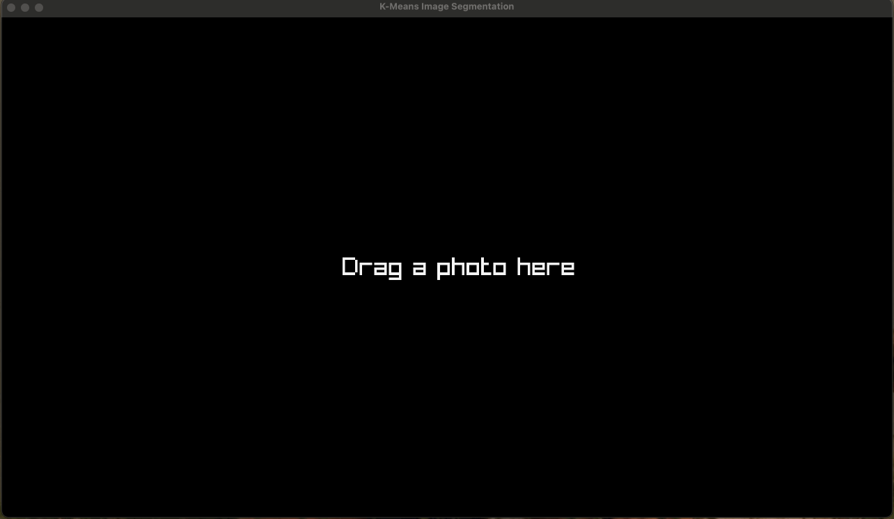

# K-means image segmentation


## Build
```console
odin build main.odin -file
./main
```

## References
[K-means clustering Wikipedia page](https://en.wikipedia.org/wiki/K-means_clustering)\
[Computerphile video on K-means image segmentation](https://www.youtube.com/watch?v=yR7k19YBqiw)

